# Diagramme de Cas d'Utilisation — PulmoScan

```mermaid
graph TB
    medecin((👨‍⚕️\nMédecin))
    ia([🤖 Modèle IA\nDenseNet121])
    email([📧 Service\nEmail])

    subgraph SYS["🏥 Système PulmoScan"]

        subgraph AUTH["Authentification"]
            UC1([Se connecter])
            UC2([Se déconnecter])
            UC3([Mot de passe oublié])
            UC4([Changer le mot de passe])
            UC5([S'inscrire avec code email])
        end

        subgraph PATIENTS["Gestion des Patients"]
            UC6([Ajouter un patient])
            UC7([Modifier un patient])
            UC8([Supprimer un patient])
            UC9([Rechercher un patient])
            UC10([Consulter fiche patient])
        end

        subgraph EXAMENS["Gestion des Examens"]
            UC11([Créer un examen])
            UC12([Sélectionner une radiographie])
            UC13([Lancer l'analyse IA])
        end

        subgraph RESULTATS["Résultats & Rapports"]
            UC14([Consulter les résultats])
            UC15([Voir l'historique des examens])
            UC16([Exporter rapport PDF])
            UC17([Copier le rapport texte])
        end

        subgraph DASH["Tableau de Bord"]
            UC18([Voir les statistiques globales])
        end

        subgraph PROFIL["Profil & Paramètres"]
            UC19([Changer la langue FR/EN/AR])
            UC20([Voir les informations du compte])
        end
    end

    %% Relations Médecin
    medecin --> UC1
    medecin --> UC2
    medecin --> UC3
    medecin --> UC4
    medecin --> UC5
    medecin --> UC6
    medecin --> UC7
    medecin --> UC8
    medecin --> UC9
    medecin --> UC10
    medecin --> UC11
    medecin --> UC15
    medecin --> UC18
    medecin --> UC19
    medecin --> UC20

    %% Include (dépendances internes)
    UC11 --> UC12
    UC12 --> UC13
    UC13 --> UC14
    UC14 --> UC16
    UC14 --> UC17

    %% Relations systèmes externes
    UC13 -.->|utilise| ia
    UC3  -.->|envoie email| email
    UC5  -.->|envoie code| email

    %% Style
    style AUTH    fill:#1a2744,stroke:#34E5C5,color:#fff
    style PATIENTS fill:#1a2744,stroke:#5A9BFF,color:#fff
    style EXAMENS  fill:#1a2744,stroke:#F59E0B,color:#fff
    style RESULTATS fill:#1a2744,stroke:#34D399,color:#fff
    style DASH     fill:#1a2744,stroke:#A78BFA,color:#fff
    style PROFIL   fill:#1a2744,stroke:#F87171,color:#fff
```

## Légende

| Symbole | Signification |
|---------|--------------|
| → (flèche pleine) | Association directe acteur → cas d'utilisation |
| -.-> (flèche pointillée) | Relation avec système externe |
| Sous-groupe | Regroupement fonctionnel |

## Acteurs

| Acteur | Type | Rôle |
|--------|------|------|
| Médecin | Acteur principal | Utilise toutes les fonctionnalités |
| Modèle IA DenseNet121 | Acteur secondaire (système) | Effectue l'inférence sur la radiographie |
| Service Email | Acteur secondaire (système) | Envoie codes de vérification et mots de passe temporaires |
