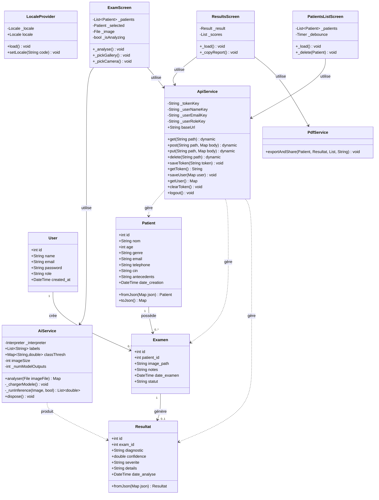

# Diagramme de Classes UML — PulmoScan

## Correspondance Classes ↔ Base de données

| Classe Dart | Table PostgreSQL | Remarques |
|-------------|-----------------|-----------|
| `Patient` | `patients` | Mapping direct, `fromJson` |
| `Examen` | `examens` | Inclut `patient_nom` via JOIN |
| `Resultat` | `resultats` | `confidence` × 100 en Dart |
| `User` | `users` | Géré côté backend uniquement |
| `AiService` | — | Inférence on-device, pas de table |
| `ApiService` | — | Couche HTTP + SharedPreferences |
