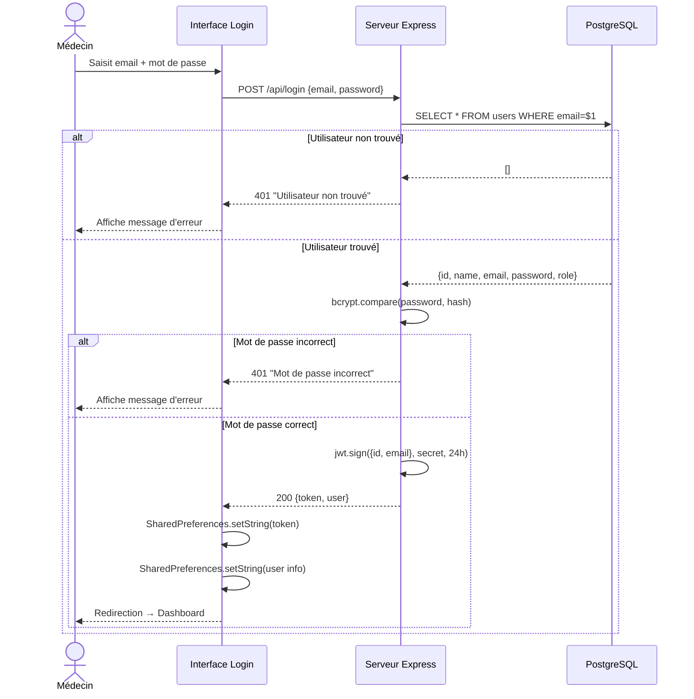
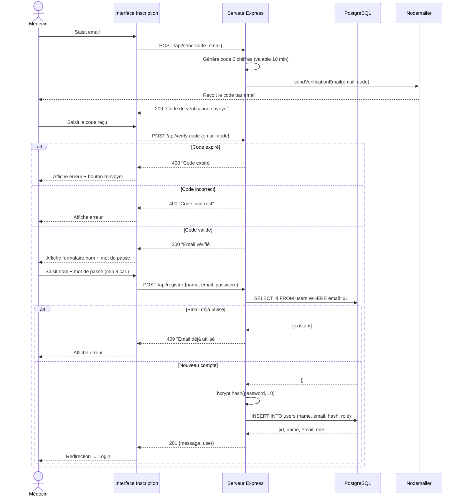
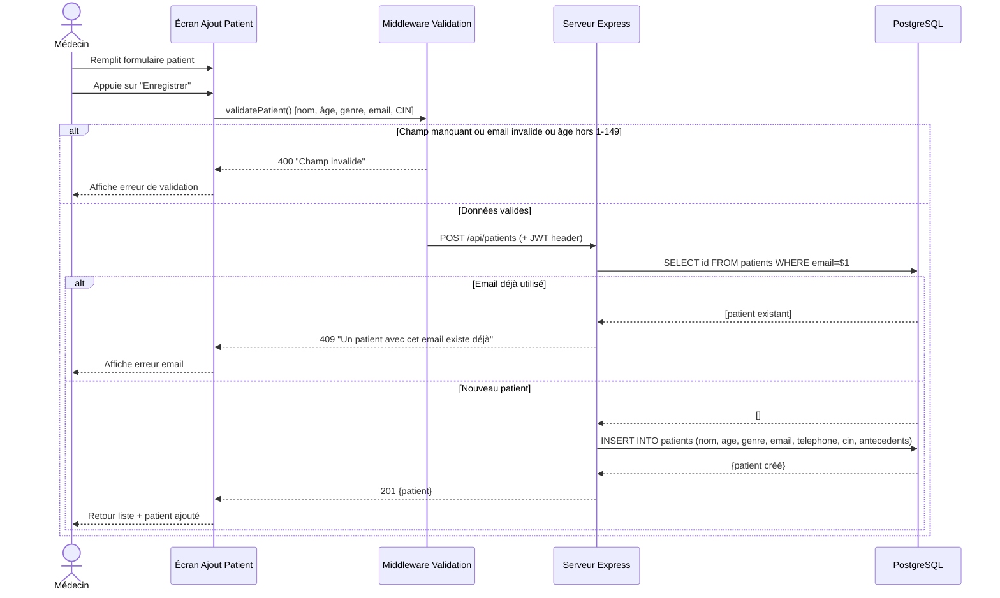
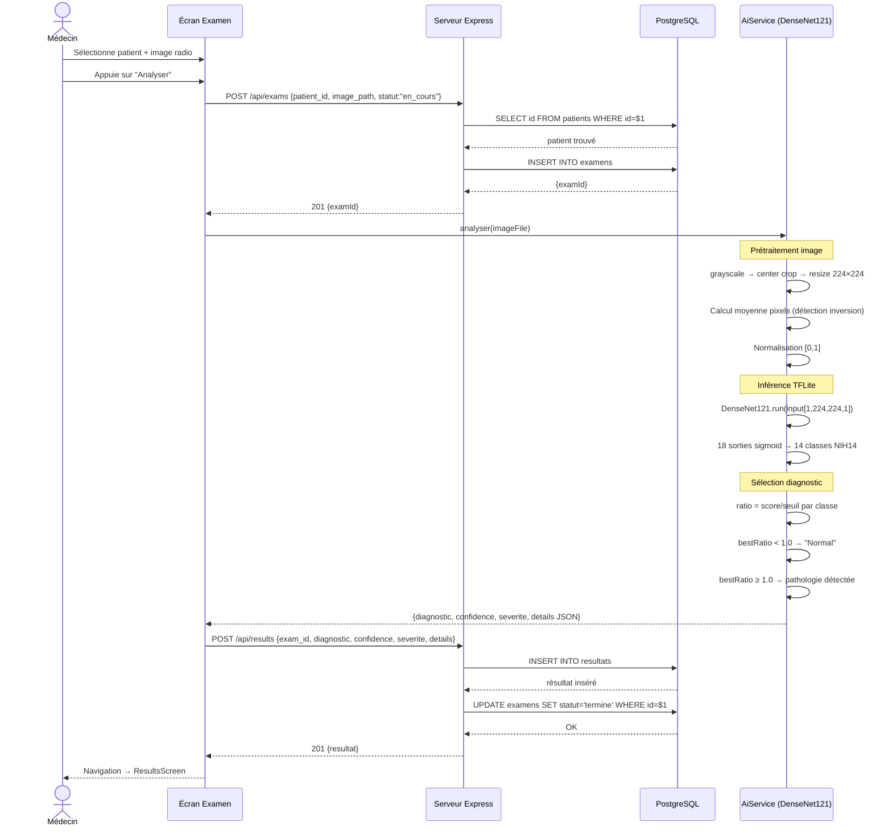
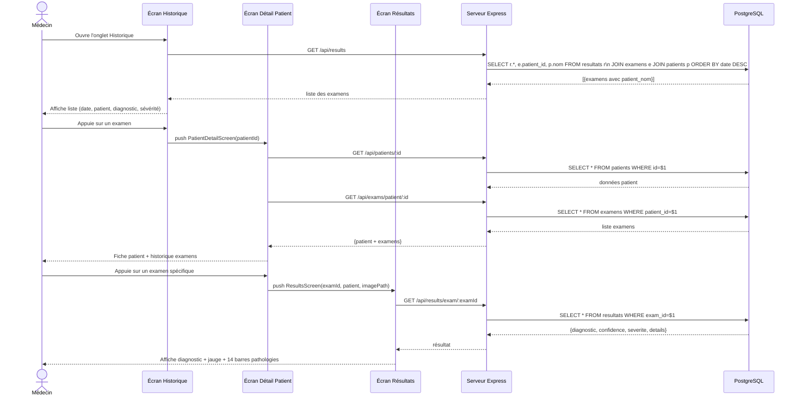
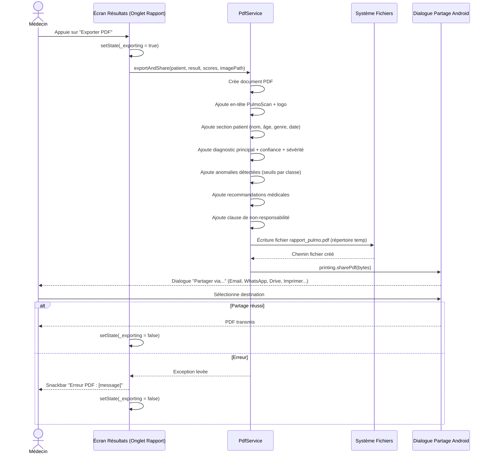

# Diagrammes de Séquence — PulmoScan

---

## Séquence 1 — Authentification (Login)

---

## Séquence 2 — Inscription avec vérification email

---

## Séquence 3 — Ajouter un patient

---

## Séquence 4 — Créer un examen et analyser la radiographie (IA)

---

## Séquence 5 — Consulter l'historique et les résultats

---

## Séquence 6 — Exporter le rapport PDF

