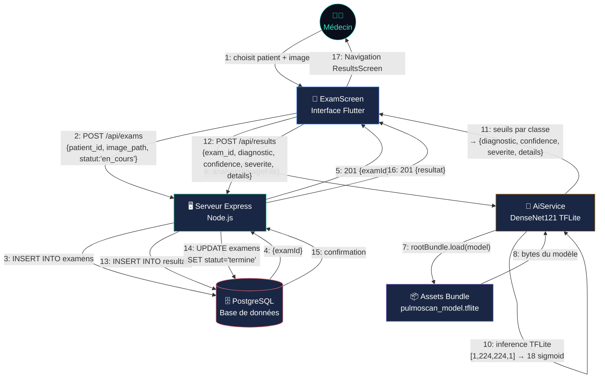

# Diagramme de Collaboration — PulmoScan
## Fonctionnalité : Analyse IA d'une radiographie thoracique

## Description des messages

| N° | Émetteur | Récepteur | Message | Type |
|----|----------|-----------|---------|------|
| 1 | Médecin | ExamScreen | Sélection patient + image | Interaction UI |
| 2 | ExamScreen | Serveur API | `POST /api/exams` | HTTP + JWT |
| 3 | Serveur API | PostgreSQL | `INSERT INTO examens` | SQL |
| 4 | PostgreSQL | Serveur API | `examId` retourné | SQL Result |
| 5 | Serveur API | ExamScreen | `201 {examId}` | HTTP Response |
| 6 | ExamScreen | AiService | `analyser(imageFile)` | Appel méthode Dart |
| 7 | AiService | Assets Bundle | Chargement modèle `.tflite` | Lecture fichier |
| 8 | Assets Bundle | AiService | Bytes du modèle | Données binaires |
| 9 | AiService | AiService | Prétraitement image | Traitement interne |
| 10 | AiService | AiService | Inférence TFLite | Calcul neuronal |
| 11 | AiService | ExamScreen | `{diagnostic, confidence, severite, details}` | Retour méthode |
| 12 | ExamScreen | Serveur API | `POST /api/results` | HTTP + JWT |
| 13 | Serveur API | PostgreSQL | `INSERT INTO resultats` | SQL |
| 14 | Serveur API | PostgreSQL | `UPDATE examens SET statut='termine'` | SQL |
| 15 | PostgreSQL | Serveur API | Confirmation | SQL Result |
| 16 | Serveur API | ExamScreen | `201 {resultat}` | HTTP Response |
| 17 | ExamScreen | Médecin | Affichage ResultsScreen | Navigation Flutter |

## Objets participants

| Objet | Type | Rôle |
|-------|------|------|
| Médecin | Acteur | Déclenche l'analyse |
| ExamScreen | Widget Flutter | Orchestre le flux complet |
| AiService | Service Dart (singleton) | Inférence IA on-device |
| Assets Bundle | Ressource Flutter | Contient le modèle TFLite (13.4 MB) |
| Serveur Express | Backend Node.js | API REST + validation + persistance |
| PostgreSQL | SGBD | Stockage examens et résultats |
