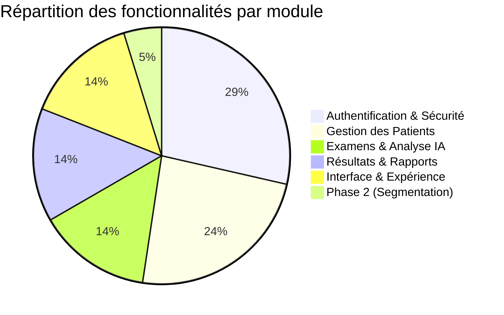
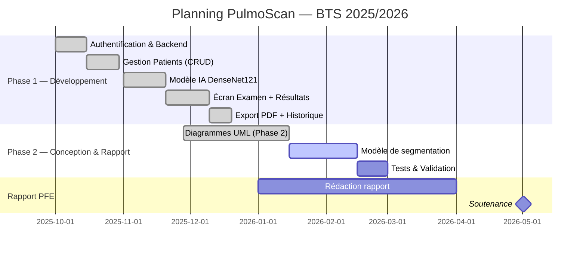

# Backlog Fonctionnel — PulmoScan

## Liste des fonctionnalités

| ID | Fonctionnalité | Description | Priorité | Statut |
|----|---------------|-------------|----------|--------|
| F1 | Authentification | Connexion avec email + mot de passe, génération JWT 24h | 🔴 Critique | ✅ Terminé |
| F2 | Inscription | Création de compte avec vérification email (code 6 chiffres) | 🔴 Critique | ✅ Terminé |
| F3 | Déconnexion | Suppression du token JWT, retour à l'écran login | 🔴 Critique | ✅ Terminé |
| F4 | Mot de passe oublié | Envoi d'un mot de passe temporaire par email | 🟡 Important | ✅ Terminé |
| F5 | Changement de mot de passe | Modification depuis le profil (ancien + nouveau) | 🟡 Important | ✅ Terminé |
| F6 | Auto-login | Reconnexion automatique si token valide présent | 🟡 Important | ✅ Terminé |
| F7 | Ajouter un patient | Formulaire complet : nom, âge, genre, email, CIN, tél, antécédents | 🔴 Critique | ✅ Terminé |
| F8 | Modifier un patient | Modification de tous les champs, vérification email unique | 🟡 Important | ✅ Terminé |
| F9 | Supprimer un patient | Suppression avec confirmation (cascade examens + résultats) | 🟡 Important | ✅ Terminé |
| F10 | Rechercher un patient | Recherche ILIKE par nom ou email avec debounce 300ms | 🟡 Important | ✅ Terminé |
| F11 | Fiche patient | Affichage complet : infos + liste examens chronologique | 🟡 Important | ✅ Terminé |
| F12 | Créer un examen | Sélection patient + image (galerie ou caméra) + notes | 🔴 Critique | ✅ Terminé |
| F13 | Analyse IA (DenseNet121) | Inférence on-device, 14 pathologies NIH14, seuils par classe | 🔴 Critique | ✅ Terminé |
| F14 | Affichage résultats | Diagnostic, jauge confiance, graphique 14 pathologies, overlay radio | 🔴 Critique | ✅ Terminé |
| F15 | Historique des examens | Liste tous les examens avec patient, date, diagnostic, sévérité | 🟡 Important | ✅ Terminé |
| F16 | Export rapport PDF | Génération PDF complet + dialogue partage système Android | 🟡 Important | ✅ Terminé |
| F17 | Copie rapport texte | Rapport formaté copié dans le presse-papier | 🟢 Secondaire | ✅ Terminé |
| F18 | Tableau de bord | Statistiques : nb patients, examens du jour, taux normaux/pathologies | 🟡 Important | ✅ Terminé |
| F19 | Changement de langue | Support FR / EN / AR avec persistance | 🟢 Secondaire | ✅ Terminé |
| F20 | Onboarding | Écran d'introduction à la première ouverture (3 slides) | 🟢 Secondaire | ✅ Terminé |
| F21 | Rate limiting | Blocage après 10 tentatives / 15 min sur login et send-code | 🟡 Important | ✅ Terminé |
| F22 | Modèle de segmentation | Segmentation des zones pulmonaires (Phase 2) | 🔴 Critique | 🔄 En cours |

## Répartition par module

## Planning de livraison

